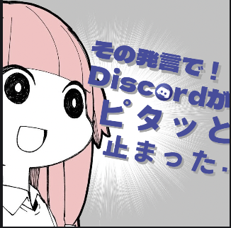

<!-- _class: lead -->
<!-- _paginate: false -->
<!-- _header: "" -->

  [ 技術者倫理 遵守済み ] プライバシー・人権完全保護

# 会話クラッシャー晒し機
### 〜 会話の「隙間（沈黙）」を可視化・戦犯公開処刑 〜

  STEM Summer Hackathon 2026 参加作品

 

**チーム「隙間ハンター」** ｜ 発表時間：約 2〜3 分

---

## 日常の課題：急に訪れる「シーン……」

楽しく会話していたはずなのに、誰かが一言発した直後に訪れる……

  

    
[ 突然の空白 ]

    <h3 style="color: #dc2626; margin: 4px 0; font-size: 20px;">会話の停止</h3>
    
会話がピタッと止まる謎の隙間

  

  

    
[ 気まずい空気 ]

    <h3 style="color: #0f172a; margin: 4px 0; font-size: 20px;">犯人探し</h3>
    
「誰のせい？」と言い出せない空気

  

  

    
[ 解散の危機 ]

    <h3 style="color: #4f46e5; margin: 4px 0; font-size: 20px;">沈黙の固定化</h3>
    
会話が完全に凍結して気まずい沈黙

  

  誰も言えない「会話を止めた戦犯」を、テクノロジーで白日の下に晒す！

---

## 解決策：会話クラッシャー晒し機

各自のスマホをマイクにし、会話の隙間（沈黙）をミリ秒単位で追跡・晒し上げ！

  

    <h4 style="margin: 0 0 6px 0; color: #0f172a; font-size: 18px;">1. QRで監視マイク化（技術者倫理 遵守）</h4>
    
音声は一切送信せず、ブラウザ内VADで「喋った/喋ってない」の判定のみ集約（プライバシー保護）。

  

  

    <h4 style="margin: 0 0 6px 0; color: #dc2626; font-size: 18px;">2. 沈黙検知で大画面に即晒し</h4>
    
全員が黙った瞬間から秒数カウントアップ。「〇〇の発言で会話凍結中！」と名指し。

  

  

    <h4 style="margin: 0 0 6px 0; color: #854d0e; font-size: 18px;">3. 5秒沈黙で巨大スタンプ爆撃</h4>
    
「その発言で！ピタッと止まった…」スタンプが集中線とともにドカンと出現！

  

  

    <h4 style="margin: 0 0 6px 0; color: #059669; font-size: 18px;">4. 沈黙ブレイカーMVP表彰</h4>
    
止まった会話を再開させた人を大量の紙吹雪で祝福し、ポジティブに回収！

  

---

## デモ実演：発言 ➔ 沈黙 ➔ スタンプ爆撃！

  

    

      <b>[ 実演シナリオ ]</b> 
      ・<b>00:08</b> 田中が「朝ご飯カツ丼」発言 
      ・<b>00:10</b> 全員沈黙（隙間発生） 
      ・<b>00:16</b> 巨大スタンプ出現！ 
      ・<b>00:20</b> 10秒完全凍結アラート 
      ・<b>00:22</b> 審査員Aが救出・MVP表彰
    

    

      動画ファイル: demo-presentation.mp4
    

  

  

    
  

---

## 技術構成 & Gemini / 低遅延AI連携による発展性

  

    <h4 style="margin: 0 0 4px 0; color: #0f172a; font-size: 17px;">[ 現行実装 ] 堅牢なエッジVAD</h4>
    

      <b>Web Audio API / AudioWorklet</b> ＋ <b>Node.js WS</b> 
      低遅延（15ms未満）・外部API非依存・端末内メモリ即時破棄で「技術者倫理」を完全遵守。
    

  

  

    <h4 style="margin: 0 0 4px 0; color: #4f46e5; font-size: 17px;">[ 発展性 ] Gemini 2.0 Flash 連携</h4>
    

      <b>Gemini Flash / Gemini Nano</b> 
      超低遅延・軽量LLMを活用し、沈黙発生時に「なぜ会話が止まったかの一言ツッコミ」や「沈黙救出キラーパス」をリアルタイム爆速生成！
    

  

  <h4 style="margin: 0 0 4px 0; color: #dc2626; font-size: 17px;">隙間を無理に埋めない「逆張りのエンタメ」</h4>
  

    会話の隙間（沈黙）を気まずいものとして隠すのではなく、 
    隙間を作った戦犯を晒して笑いに変える ことで、結果的に会話が爆発的に盛り上がる！
  

  ご清聴ありがとうございました！

